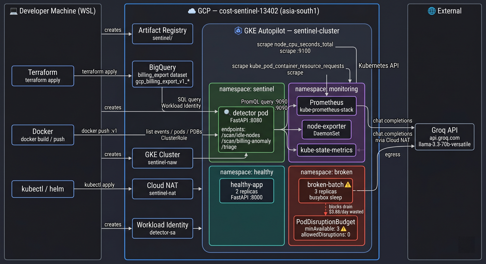

# GKE Cost Sentinel

> A Kubernetes cost-intelligence service that detects waste in a GKE Autopilot cluster and produces LLM-generated triage reports — built end-to-end with Terraform, Prometheus, BigQuery, and a Groq-powered agent.



---

## What it does

Most Kubernetes cost waste goes undetected because the signals are scattered — idle nodes in Prometheus, billing spikes in GCP, stuck workloads in Kubernetes events — with no single tool correlating them. GKE Cost Sentinel reads from all three sources and uses an LLM to synthesize them into a human-readable triage report.

The system has three layers:

**1. A target cluster** running two namespaces:
- `healthy` — a normal FastAPI service with proper resource requests
- `broken` — a deliberately misconfigured batch job with a `PodDisruptionBudget` that prevents node drain, wasting ~$3.88/day in billed-but-idle compute

**2. Two data sources:**
- Prometheus via `kube-prometheus-stack`, scraping node and pod metrics
- GCP Billing Export streamed to BigQuery, providing per-service hourly spend

**3. A detector + agent service** with three endpoints:
- `GET /scan/idle-nodes` — flags nodes below a CPU utilisation threshold with estimated daily waste
- `GET /scan/billing-anomaly` — flags GCP services whose hourly spend exceeds 2σ above their 7-day baseline
- `POST /triage` — accepts an alert, gathers Kubernetes context, and returns a structured markdown report from the LLM

---

## Architecture

<!-- PLACEHOLDER: Add your architecture diagram here (docs/architecture.png) -->
<!-- Suggested: Excalidraw diagram showing: -->
<!-- WSL laptop → kubectl/port-forward → GKE Autopilot cluster -->
<!-- Cluster internals: sentinel ns (detector pod) → Prometheus, Kubernetes API, Cloud NAT → Groq API -->
<!-- detector pod → Workload Identity → BigQuery billing_export dataset -->

The detector runs inside the cluster in its own `sentinel` namespace. It authenticates to GCP services (BigQuery) via Workload Identity — no service account key files anywhere.

---

## Tech stack

| Layer | Technology |
|---|---|
| Cloud | GCP — `cost-sentinel-13402`, region `asia-south1` |
| Cluster | GKE Autopilot |
| Infrastructure as Code | Terraform 1.5+ |
| Metrics | Prometheus via `kube-prometheus-stack` Helm chart (v65.0.0) |
| Billing data | GCP Billing Export → BigQuery dataset `billing_export` |
| Detector service | Python 3.11, FastAPI, uvicorn |
| LLM agent | Groq API — `llama-3.3-70b-versatile` |
| Auth | Workload Identity (no key files) |
| Image registry | Artifact Registry — `asia-south1-docker.pkg.dev/cost-sentinel-13402/sentinel` |

---

## Repository layout

```
gke-cost-sentinel/
├── terraform/              # All GCP infrastructure
│   ├── cluster.tf          # GKE Autopilot cluster
│   ├── network.tf          # VPC, subnet, Cloud NAT
│   ├── bigquery.tf         # Billing export dataset
│   ├── artifact_registry.tf
│   └── iam.tf              # detector-sa, Workload Identity binding, BigQuery roles
├── workloads/
│   ├── healthy-app/        # Normal FastAPI workload
│   └── broken-batch/       # Intentionally misconfigured — the proof artifact
├── detector/               # The detector + agent service
│   ├── Dockerfile
│   ├── pyproject.toml
│   └── src/
│       ├── main.py         # FastAPI app, route registration
│       ├── config.py       # Pydantic Settings (env vars)
│       ├── clients/        # Prometheus, BigQuery, Kubernetes thin wrappers
│       ├── scanners/       # idle_nodes.py, billing_anomaly.py
│       └── triage/         # agent.py, context.py, prompts.py
├── deploy/                 # In-cluster Kubernetes manifests
│   ├── namespace.yaml
│   ├── serviceaccount.yaml # Annotated for Workload Identity
│   ├── rbac.yaml           # ClusterRole — read events, pods, nodes, PDBs
│   ├── configmap.yaml      # Non-secret env vars
│   ├── deployment.yaml
│   └── service.yaml
└── helm-values/
    └── kube-prometheus-stack.yaml
```

---

## The intentional incident

`workloads/broken-batch/` is a deliberately broken workload. It exists to give the detector something real to find.

**The misconfiguration:** a 3-replica `Deployment` running `busybox` in an infinite sleep loop — requesting `500m CPU` and `512Mi` memory per pod but using essentially zero — paired with a `PodDisruptionBudget` where `minAvailable: 3` equals the replica count.

**Why it's expensive:** GKE Autopilot bills per pod resource *request*, not actual usage. Three pods × 500m CPU × $0.098/vCPU-hr × 24h ≈ **$3.53/day** for doing nothing.

**Why the PDB makes it worse:** Node drain is a voluntary disruption. With `minAvailable: 3` on 3 replicas, evicting even one pod violates the budget — so the autoscaler can never reclaim the node. The node stays live and billed indefinitely.

**The right fix:** change `minAvailable: 2`. One line. Allows disruptions, unblocks drain.

```
kubectl get pdb -n broken
```
```
NAME               MIN AVAILABLE   ALLOWED DISRUPTIONS
broken-batch-pdb   3               0          ← stuck
```

---

## Triage agent output

When `/triage` receives an idle-node alert, it:
1. Calls the Kubernetes API to gather recent pod events, deployment revision history, and all PDBs cluster-wide
2. Maps the node IP to a Kubernetes node name and samples logs from a pod running on it
3. Sends everything to `llama-3.3-70b-versatile` with a structured prompt
4. Returns a markdown report with four sections

**Example response:**

<!-- PLACEHOLDER: Screenshot of the triage JSON response in a terminal -->

```json
{
  "alert": { "type": "idle_node", "resource": "10.10.0.8:9100", ... },
  "context_collected": { "events": 41, "deploys": 8, "pdbs": 3 },
  "report_markdown": "## Likely cause\n...\n## Suggested action\n...\n## Blast radius\n...\n## Confidence\nLow — ..."
}
```

---

## Setup

### Prerequisites

- GCP project with billing enabled
- Terraform 1.5+, `gcloud` CLI, `kubectl`, `helm`, `docker`
- Groq API key from [console.groq.com](https://console.groq.com)

### 1 — Provision infrastructure

```bash
cd terraform
terraform init
terraform apply
# Creates: VPC, GKE Autopilot cluster, BigQuery dataset,
#          Artifact Registry, detector-sa, Workload Identity binding, Cloud NAT
```

Enable billing export manually in the GCP console:
**Billing → Billing export → Detailed usage cost → Edit settings → Dataset: `billing_export`**

### 2 — Get cluster credentials

```bash
gcloud container clusters get-credentials sentinel-cluster \
  --region=asia-south1 --project=cost-sentinel-13402
```

### 3 — Deploy workloads

```bash
# Build and push healthy-app
docker build -t asia-south1-docker.pkg.dev/cost-sentinel-13402/sentinel/healthy-app:v1 workloads/healthy-app/
docker push asia-south1-docker.pkg.dev/cost-sentinel-13402/sentinel/healthy-app:v1

kubectl apply -f workloads/healthy-app/manifests.yaml
kubectl apply -f workloads/broken-batch/manifests.yaml
```

### 4 — Install Prometheus

```bash
helm repo add prometheus-community https://prometheus-community.github.io/helm-charts
helm repo update
kubectl create namespace monitoring
helm install kps prometheus-community/kube-prometheus-stack \
  --namespace monitoring --version 65.0.0 \
  -f helm-values/kube-prometheus-stack.yaml
```

### 5 — Build and deploy the detector

```bash
docker build -t asia-south1-docker.pkg.dev/cost-sentinel-13402/sentinel/detector:v1 detector/
docker push asia-south1-docker.pkg.dev/cost-sentinel-13402/sentinel/detector:v1

kubectl apply -f deploy/namespace.yaml
kubectl apply -f deploy/serviceaccount.yaml
kubectl apply -f deploy/rbac.yaml
kubectl apply -f deploy/configmap.yaml

kubectl create secret generic detector-secrets \
  --namespace sentinel \
  --from-literal=GROQ_API_KEY="$GROQ_API_KEY"

kubectl apply -f deploy/deployment.yaml
kubectl apply -f deploy/service.yaml
```

### 6 — Verify

```bash
kubectl get pods -n sentinel
# NAME                        READY   STATUS    RESTARTS   AGE
# detector-xxxxxxxxx-xxxxx    1/1     Running   0          2m
```

```bash
# Healthcheck
kubectl run -it --rm debug --image=curlimages/curl --restart=Never -- \
  curl -s http://detector.sentinel.svc.cluster.local/healthz
# {"status":"ok"}
```

---

## Usage

### Idle node scan

```bash
# Port-forward Prometheus locally
kubectl port-forward -n monitoring svc/kps-kube-prometheus-stack-prometheus 9090:9090

# From local machine with detector running (uvicorn src.main:app --reload)
curl -s localhost:8000/scan/idle-nodes | jq .
```

```json
{
  "count": 2,
  "idle_nodes": [
    {
      "node": "10.10.0.8:9100",
      "cpu_utilization_pct": 5.82,
      "vcpus": 8,
      "estimated_daily_waste_usd": 17.72
    }
  ]
}
```

<!-- PLACEHOLDER: Screenshot of idle-nodes response in terminal -->

### Billing anomaly scan

```bash
curl -s localhost:8000/scan/billing-anomaly | jq .
```

Returns services with hourly spend more than 2σ above their 7-day baseline. Requires ~24h of billing data in BigQuery after the broken workload starts running.

<!-- PLACEHOLDER: Screenshot of billing-anomaly response showing broken-batch cost spike -->

### Triage

```bash
curl -s -X POST localhost:8000/triage \
  -H "Content-Type: application/json" \
  -d '{
    "type": "idle_node",
    "resource": "10.10.0.8:9100",
    "detected_at": "2026-06-01T00:00:00Z",
    "details": {"cpu_utilization_pct": 5.82, "vcpus": 8, "estimated_daily_waste_usd": 17.72}
  }' | jq .report_markdown -r
```

<!-- PLACEHOLDER: Screenshot of rendered triage markdown report -->

---

## Local development

```bash
cd detector
python3 -m venv .venv && source .venv/bin/activate
pip install -e .

export GROQ_API_KEY="gsk_..."

# Port-forward Prometheus in a separate terminal
kubectl port-forward -n monitoring svc/kps-kube-prometheus-stack-prometheus 9090:9090

uvicorn src.main:app --reload
```

The detector auto-detects in-cluster vs local: if `$KUBERNETES_SERVICE_HOST` is not set it falls back to `~/.kube/config`.

---

## Key design decisions

**Workload Identity over service account keys** — The detector pod carries no credentials. GKE injects a token for `detector-sa` automatically, and the BigQuery client picks it up via Application Default Credentials. Nothing to rotate, nothing to leak.

**Cloud NAT for egress** — GKE Autopilot nodes have no public IPs. A Cloud Router + NAT gateway gives pods outbound internet access (needed for the Groq API) without exposing them inbound.

**Proportional context truncation** — The triage context budget is ~3000 tokens. Events get 40%, deployment history 30%, PDBs 15%, pod logs 15%. Hard-truncated per section so no single noisy namespace drowns out the others.

**`kube-prometheus-stack` with 6 components disabled** — GKE Autopilot blocks writes to `kube-system`. The chart tries to create headless Services there for `kubelet`, `coreDns`, `kubeControllerManager`, `kubeScheduler`, `kubeEtcd`, and `kubeProxy`. All six are disabled in `helm-values/`. Node-exporter still runs and provides `node_cpu_seconds_total` which is all the idle-node scanner needs.

---

## Milestones

- [x] **M1** — Terraform provisions cluster, VPC, BigQuery, Artifact Registry, IAM; both workloads deployed; Prometheus installed and scraping
- [x] **M2** — Detector runs locally; `/scan/idle-nodes` returns live data; `/scan/billing-anomaly` queries real BigQuery export
- [x] **M3** — LLM triage agent working; detector containerised and deployed in-cluster; `/triage` verified end-to-end from a debug pod

---

## What this project deliberately excludes

No frontend, no forecasting, no multi-cluster support, no GitOps, no alerting webhooks, no persistence layer, no RAG. These are explicit non-goals — the point is understanding the full stack, not maximising feature count.
